# Piano di Miglioramento per l'App Streamlit Business Plan Builder

## Panoramica
L'app attuale è una soluzione complessa e modulare per la generazione interattiva di business plan, con funzionalità di caricamento documenti, personalizzazione struttura, generazione AI e navigazione tra sezioni.

---

## Aree di Miglioramento

### 1. UX/UI
- Migliorare il feedback utente con messaggi più chiari e tempestivi.
- Rendere più visibili progress bar e spinner durante le operazioni lunghe.
- Implementare preview in tempo reale delle sezioni generate o modificate.
- Semplificare e rendere più intuitiva l'interfaccia per la gestione della struttura del piano (aggiunta, eliminazione, rinomina sezioni).

### 2. Performance
- Ottimizzare il caching dei dati e degli output generati dall'AI per evitare ricalcoli inutili.
- Gestire in modo asincrono le chiamate ai modelli AI per migliorare la reattività.
- Rendere più efficiente il caricamento e l'estrazione del testo dai documenti caricati.

### 3. Funzionalità
- Aggiungere esportazioni in formati PDF e DOCX oltre al TXT attuale.
- Supportare la generazione multi-lingua per ampliare il bacino di utenza.
- Integrare altri servizi esterni per arricchire i dati di mercato o altre sezioni.
- Permettere la creazione di template personalizzati per il business plan.

### 4. Robustezza
- Migliorare la gestione degli errori con messaggi più dettagliati e azioni di recupero.
- Implementare logging e monitoraggio per facilitare il debug e la manutenzione.
- Introdurre salvataggio automatico dello stato e backup per evitare perdite di dati.

### 5. Collaborazione
- Aggiungere funzionalità multi-utente per lavorare in team.
- Implementare condivisione e collaborazione in tempo reale sui business plan.

### 6. Documentazione e Onboarding
- Integrare guide e tutorial passo-passo all'interno dell'app.
- Fornire documentazione API e spiegazioni sul flusso di lavoro per facilitare l'adozione.

---

## Diagramma di Sintesi

```mermaid
flowchart TD
    A[Analisi app attuale] --> B[UX/UI]
    A --> C[Performance]
    A --> D[Funzionalità]
    A --> E[Robustezza]
    A --> F[Collaborazione]
    A --> G[Documentazione]

    B --> B1[Migliorare feedback utente]
    B --> B2[Progress bar e spinner più visibili]
    B --> B3[Preview in tempo reale delle sezioni]
    B --> B4[Interfaccia più intuitiva per gestione sezioni]

    C --> C1[Ottimizzare caching dati e output AI]
    C --> C2[Gestione asincrona chiamate AI]
    C --> C3[Caricamento documenti più efficiente]

    D --> D1[Esportazione in PDF e DOCX]
    D --> D2[Supporto multi-lingua]
    D --> D3[Integrazione con altri servizi esterni]
    D --> D4[Template personalizzabili per business plan]

    E --> E1[Gestione errori più dettagliata]
    E --> E2[Logging e monitoraggio]
    E --> E3[Salvataggio automatico stato e backup]

    F --> F1[Funzionalità multi-utente]
    F --> F2[Condivisione e collaborazione in tempo reale]

    G --> G1[Guide e tutorial integrati]
    G --> G2[Documentazione API e flusso app]
```

---

Questo piano può essere usato come roadmap per sviluppi futuri e miglioramenti continui dell'app.